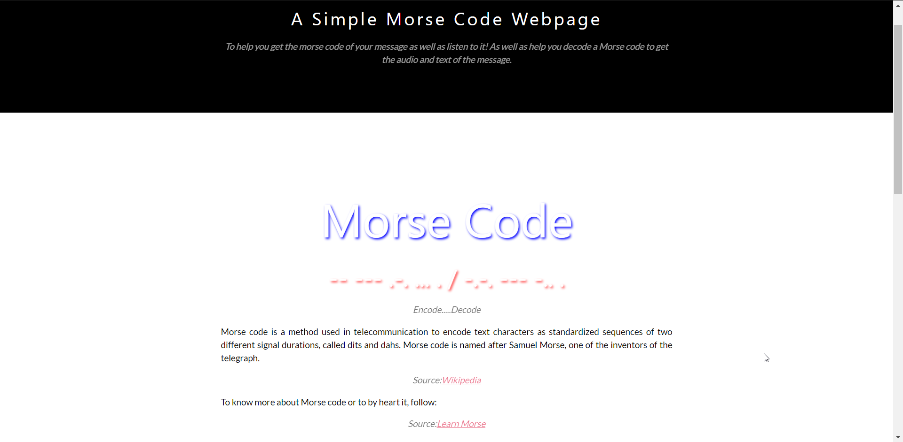

<style>
    .card {
        width: 130px;
        height: 195px;
        background: url("mor2.png") no-repeat;
        display: inline-block;
    }
    .card:hover {
        background: url("mor3.png") no-repeat;
    }
</style>
<h1>Morse Code Encoder/Decoder</h1>

This is a project that uses playsound in Python to provide the user with an audio of the Morse Code. Also, pyttsx is used to speak out the text encoded in the Morse code or the decoded text after running the program. 
<br>
<br>
The front end of the site is created in Django and can be deployed on a webserver that has playsound/pyttsx installed on it. 

<h1>Implementation Details</h1>
The basic idea is that using some basic codes, we can find the Morse code of a given text an vice-versa. Playsound module is then used to imitate the dit-dah sound of Mosre code corresponding to dot-dash. On the other hand, when we are provided with a Morse code, after decoding the text message, pyttsx provides the user with the audio of the message.

<h1>Build Instructions</h1>
Simply clone the repository and run the following command in the morsee folder:

```python manage.py runserver```

pyttsx and playsound need to be installed for the site to work along with django. 
<h1>Screenshots of the Portal</h1>
<br>

<div class="card"></div>
